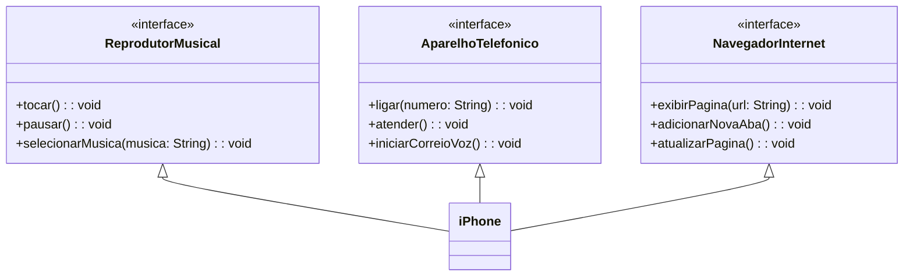

## Modelagem UML de um iPhone (para fins didáticos)

Este repositório contém a modelagem UML de um iPhone, com foco nas funcionalidades básicas apresentadas no vídeo de lançamento do iPhone de 2007. O objetivo deste projeto é demonstrar a aplicação da modelagem UML na representação de um sistema de software, utilizando como exemplo um dispositivo popular e familiar.

## Diagrama UML (Mermaid)




## Implementação em Java

```java
// Interface ReprodutorMusical
interface ReprodutorMusical {
    void tocar();
    void pausar();
    void selecionarMusica(String musica);
}

// Interface AparelhoTelefonico
interface AparelhoTelefonico {
    void ligar(String numero);
    void atender();
    void iniciarCorreioVoz();
}

// Interface NavegadorInternet
interface NavegadorInternet {
    void exibirPagina(String url);
    void adicionarNovaAba();
    void atualizarPagina();
}

// Classe iPhone
class iPhone implements ReprodutorMusical, AparelhoTelefonico, NavegadorInternet {
    @Override
    public void tocar() {
        System.out.println("Tocando música...");
    }

    @Override
    public void pausar() {
        System.out.println("Pausando música...");
    }

    @Override
    public void selecionarMusica(String musica) {
        System.out.println("Selecionando música: " + musica);
    }

    @Override
    public void ligar(String numero) {
        System.out.println("Ligando para " + numero);
    }

    @Override
    public void atender() {
        System.out.println("Atendendo chamada...");
    }

    @Override
    public void iniciarCorreioVoz() {
        System.out.println("Iniciando correio de voz...");
    }

    @Override
    public void exibirPagina(String url) {
        System.out.println("Exibindo página: " + url);
    }

    @Override
    public void adicionarNovaAba() {
        System.out.println("Adicionando nova aba...");
    }

    @Override
    public void atualizarPagina() {
        System.out.println("Atualizando página...");
    }
}
```

### Implementação em Java:

O projeto inclui uma implementação básica em Java das interfaces e da classe iPhone, como demonstração da aplicação da modelagem UML. O código é simplificado para fins didáticos e não inclui funcionalidades complexas como interação com o usuário ou persistência de dados.

### Observações:

* O projeto é para fins didáticos e não representa uma implementação completa de um iPhone.
* A implementação em Java é básica e serve para ilustrar a aplicação da modelagem UML.
* O diagrama UML e a implementação em Java podem ser utilizados como base para a criação de projetos mais complexos.
